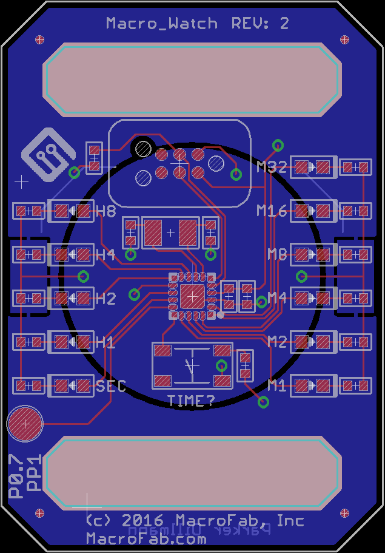
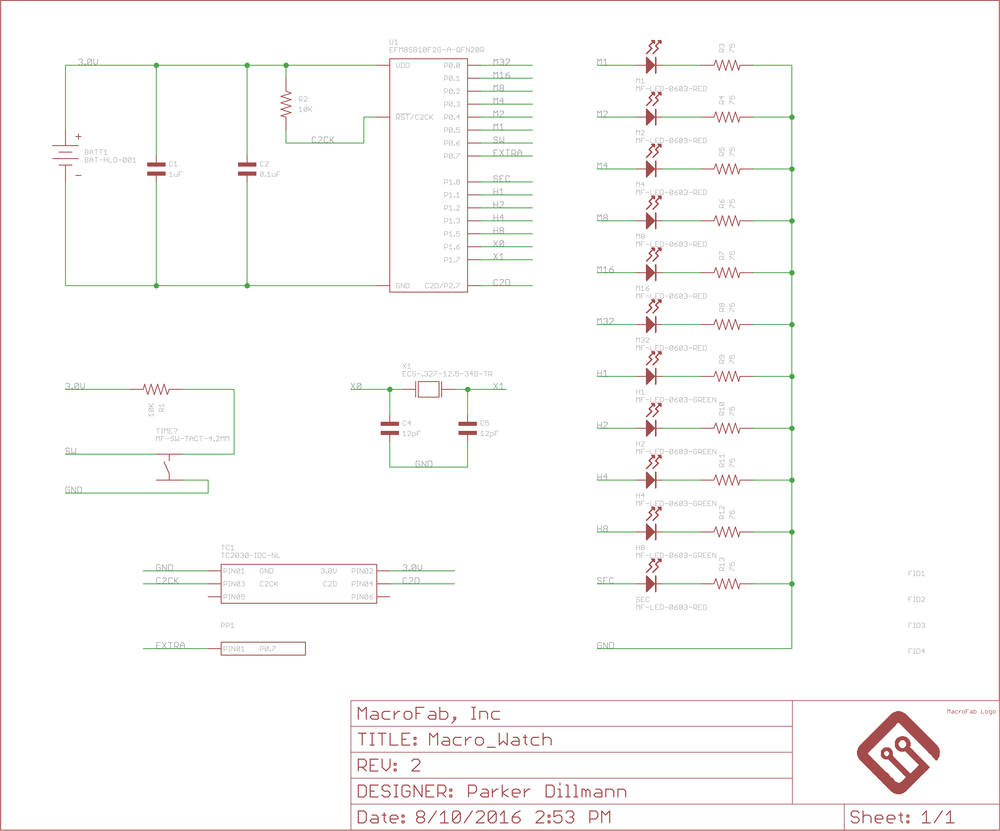
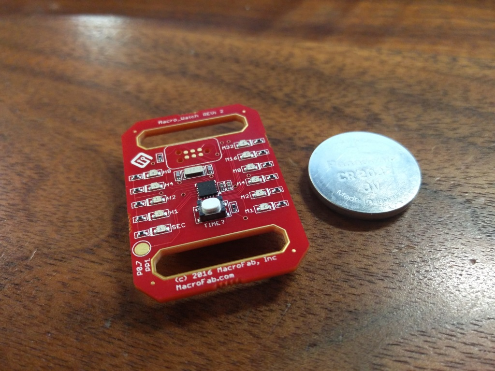
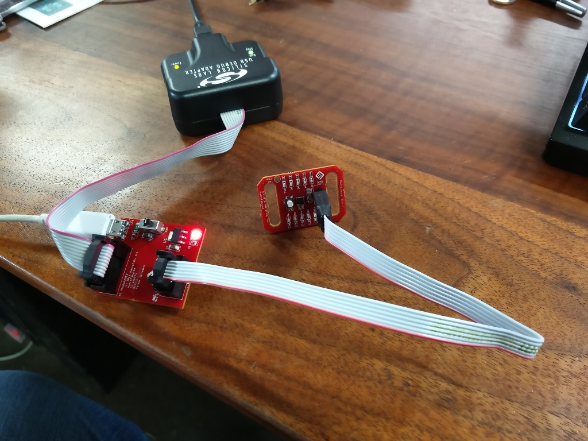

***
### Macro_Watch_V2
***
**Low cost, binary watch based off the Silicon Labs EFM8SB10F2G-A-QFN20R MCU for promotional purposes at MacroFab, INC.**

This repository contains all the documentation and instructions needed to build a Macro_Watch. The Macro_Watch is designed to be mounted on an ESD wrist band. It is designed to be programmed with the [Silicon Labs USB Debug Adapter](http://www.silabs.com/products/mcu/Pages/USBDebug.aspx) and the [SiLabs2TC](https://github.com/MacroFab/Macro_Articles/tree/master/SiLabs2TC) board. 

Check the [MacroFab, INC. Engineering Blog](https://macrofab.com/blog/engineering/) for more information.

***
**License Information**

This project is under the [Creative Commons Attribution-ShareAlike 4.0 International License](LICENSE.md). This project is provided with no warranty and should be used at your own risk. 

***
**Board Layout**

***
**Board Schematic**

***
**Completed Macro_Watch V2**

***
**Macro_Watch V2 being programmed**

***
**Directory listing of the repository**

| Directory | Description |
|---|---|
| Hardware | Contains all the hardware files for the Macro_Watch. Designed with Eagle V6.0+. | 
| Software | Has all the firmware that needs to be loaded onto the Macro_Watch. Written in C for Simplicity Studio. |

***
**Credits**

Designed by:   
Parker Dillmann  

Software by:   
Parker Dillmann  

***

